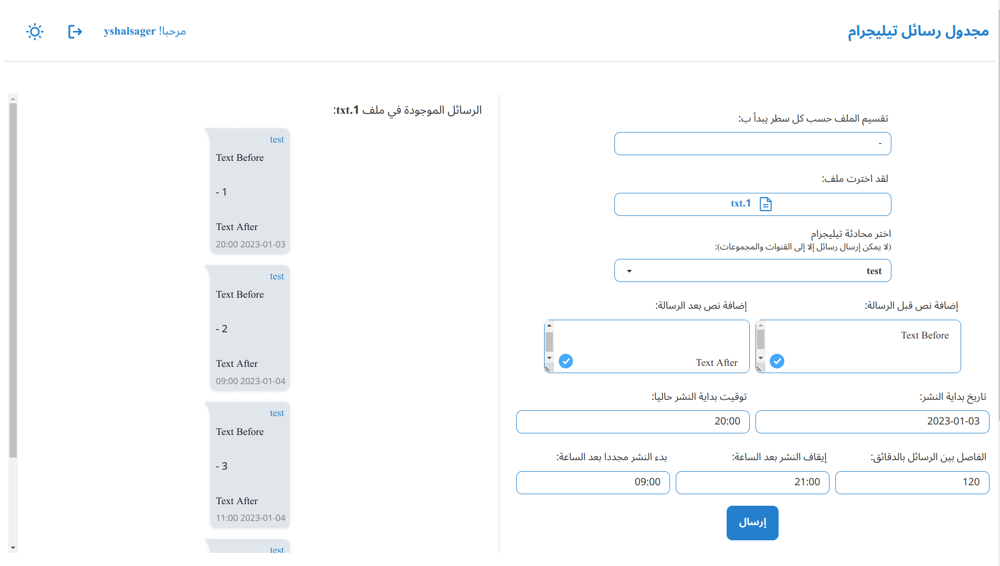
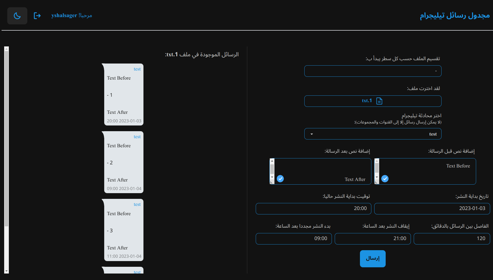

# Telegram Scheduler

> A simple web app to batch send/schedule messages from text file to Telegram chat.





## Demo

You can check it [here](https://telegram-scheduler.yshalsager.com).

## Features

- 100% local and safe, no external connections or data collection.
- Sign in Telegram using browser, no external services or hassle.
- Save login for future usage.
- Control how to split the text file by specifying line starts with character.
- Add text before or after the message from file.
- Set a start date and time for scheduled messages, control sending interval, and durations to not send in.
- Live preview your messages text, chat, and time that it will be sent at.
- Light and Dark themes.

## Technologies / External libraries

- HTML5, CSS, and JavaScript.
- [Svelte](https://github.com/sveltejs/svelte) + [SvelteKit](https://github.com/sveltejs/kit).
- [Tailwind CSS](https://github.com/tailwindlabs/tailwindcss) with [DaisyUI](https://github.com/saadeghi/daisyui).
- [gramjs](https://github.com/gram-js/gramjs) and [date-fns](https://github.com/date-fns/date-fns).
- [Vite](https://github.com/vitejs/vite).
- npm.

## Developing

Once you've created a project and installed dependencies with `npm install` (or `pnpm install` or `yarn`), start a development server:

```bash
npm run dev

# or start the server and open the app in a new browser tab
npm run dev -- --open
```

## Building

To create a production version of your app:

```bash
npm run build
```

You can preview the production build with `npm run preview`.
